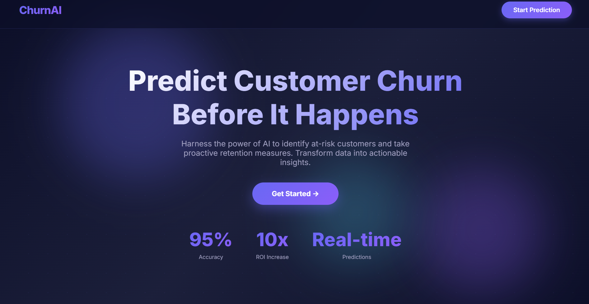
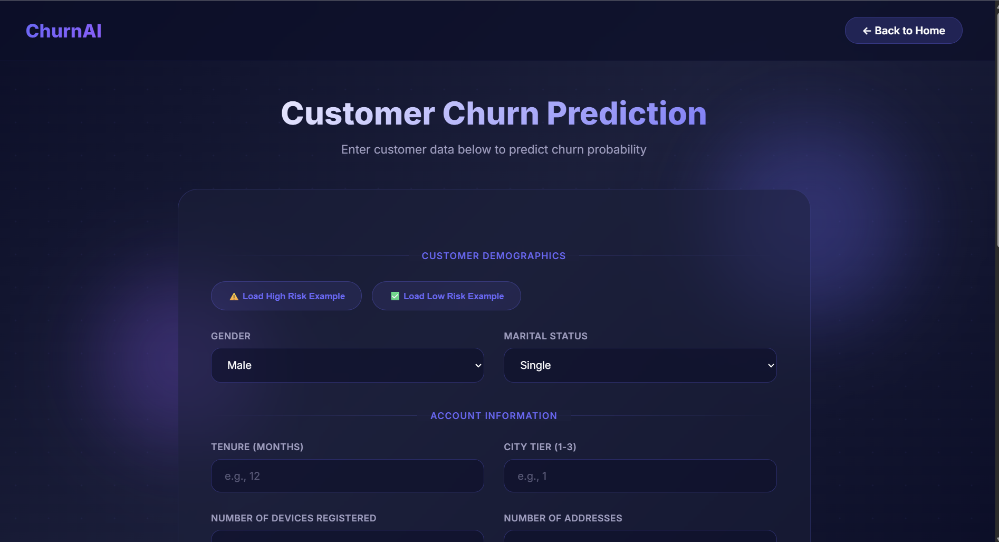
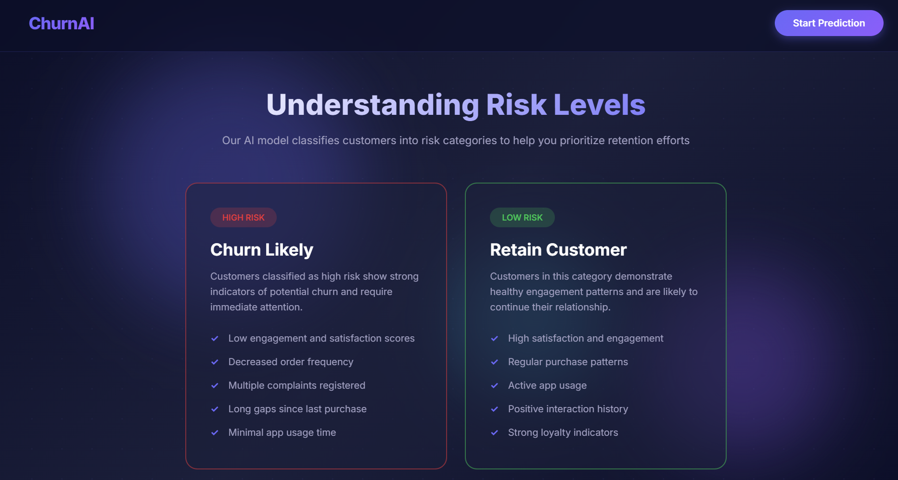
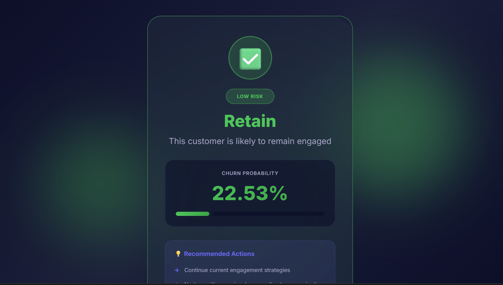

# 📊 Customer Churn Prediction


---

## 📸 Screenshots

| Home Page | Form Page |
|-----------|----------------|
| " />
) |  |

| Data Insights | Model Accuracy |
|---------------|----------------|
|  |  |

---

## 🌱 About the Project
**Customer Churn Prediction** predicts whether a customer will leave a company or service.  
This helps businesses take proactive steps to retain valuable customers, improve marketing strategies, and reduce revenue loss.  
Built using Python, Flask, and Machine Learning.  

---

## 💡 Problem Statement
Many businesses face high churn rates:  
- Customers leave without warning.  
- Lost customers mean lost revenue.  
- Companies struggle to identify at-risk customers before it’s too late.  

---

## 💡 Our Solution
We built **Customer Churn Prediction** to:  
- 📊 Analyze customer behavior data.  
- 🧠 Predict potential churn using Machine Learning models.  
- 💡 Provide actionable insights for retention strategies.  
- 🌐 Allow businesses to visualize trends and patterns with an interactive dashboard.  

---

## 🚀 Features
- 📈 **Data Visualization** – Understand customer patterns with charts and graphs.  
- 🧠 **ML Prediction** – Predict churn with high accuracy.  
- 📝 **Input Form** – Add new customer data and predict churn probability.  
- 💾 **Export Results** – Save predictions for further analysis.  
- 🌐 **Web Interface** – Easy-to-use Flask web app.  

---

## 🛠 Tech Stack
- **Frontend:** HTML, CSS, Bootstrap  
- **Backend:** Python, Flask  
- **Database:** CSV / SQL (depending on your implementation)  
- **Machine Learning:** Scikit-Learn, Pandas, NumPy, Matplotlib  

---

## ⚡ How to Run
1. Clone the repo:  
   ```bash
   git clone https://github.com/yourusername/customer-churn-prediction.git
